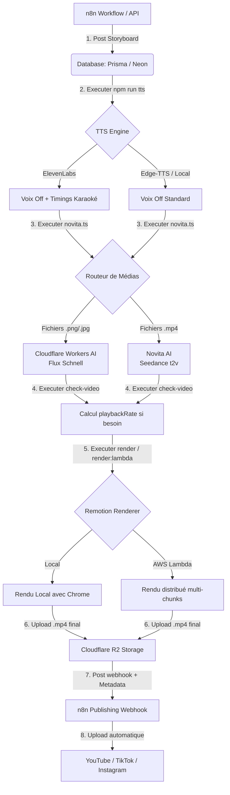

# 🎬 Pipevideo — Content Factory Pipeline

Pipevideo est un pipeline automatisé de production vidéo à haute rétention, piloté par IA. À partir d'un storyboard structuré au format JSON, le système orchestre la génération de voix off réalistes, produit les médias visuels (images et vidéos) via des IA génératives spécialisées, applique des animations complexes (Ken Burns, sous-titres karaoké réactifs, transitions cinématiques, sound design), effectue le rendu (localement ou parallélisé sur AWS Lambda), puis publie la vidéo finale via des webhooks sécurisés.

---

## 📐 Architecture du Pipeline

Le schéma ci-dessous illustre le parcours de génération d'une vidéo, de l'idée initiale à sa publication automatique :



---

## 🌟 Fonctionnalités Clés

*   **Voix Off Synchrone** : Génération de voix ultra-réalistes via **ElevenLabs** (ou **Edge-TTS** pour l'économie) avec extraction automatique des timings mot-à-mot pour des sous-titres karaoké fluides et rythmés.
*   **Génération Hybride de Médias** :
    *   **Images / Diaporamas** : Générés via **Cloudflare Workers AI** (Modèle `@cf/black-forest-labs/flux-1-schnell`), ultra-rapide et économique.
    *   **Vidéos** : Générées via **Novita AI** (Modèle `seedance-v1.5-pro-t2v` de Seedance) pour des plans animés réalistes en 9:16 ou 16:9.
*   **Ajustement de Vitesse Dynamique** : Analyse automatique de l'audio de chaque scène. Si un clip vidéo est trop court, le système calcule et injecte un `playbackRate` de ralenti pour étirer la vidéo sans gel ni bouclage.
*   **Édition Remotion Avancée** : Effets de caméra (Ken Burns zoom in/out, tremblements "shake"), transitions variées (`fade`, `slide`, `wipe`, `black`, `whipPan`, `glitchCut`, `particleDissolve`), sound design complexe (musique de fond + bruitages calés à la milliseconde).
*   **Rendu AWS Lambda Pass-through** : Déploiement incrémental et rendu cloud parallélisé sur des centaines d'instances Lambda pour un rendu ultra-rapide, peu importe la durée de la vidéo.
*   **Hébergement & Webhook n8n** : Téléversement du résultat sur un bucket **Cloudflare R2** public, puis notification de publication vers n8n incluant le lien de la vidéo et ses métadonnées SEO complètes (`title`, `description`, `tags`).

---

## 📂 Structure du Projet

```
storyboard.json             # Fichier de définition de la vidéo en cours
src/
  ├── app/
  │   └── api/
  │       ├── render/       # Route API de rendu local/lambda + notification n8n
  │       └── webhook/      # Webhook de réception du storyboard depuis n8n
  ├── video/                # Éléments de montage et compositions Remotion
  │   ├── Root.tsx          # Point d'entrée de la composition Remotion
  │   ├── Main.tsx          # Ordonnancement des scènes et transitions
  │   ├── Scene.tsx         # Rendu individuel (vidéo/diaporama/sons/zoom)
  │   └── Subtitles.tsx     # Affichage karaoké, fondant, ou cinématique
  ├── novita.ts             # Orchestrateur de génération d'images/vidéos par IA
  ├── check-media.ts        # Script de vérification et d'ajustement des vitesses
  ├── tts.ts                # Générateur de voix off et de synchronisation
  ├── render.ts             # Script de rendu vidéo local
  ├── render-lambda.ts      # Script de rendu cloud AWS Lambda
  ├── types.ts              # Validation de schéma Zod, types et constantes
  └── lib/
      └── db.ts             # Client Prisma d'accès à la base de données
```

---

## ⚙️ Configuration de l'Environnement

Créez un fichier `.env` à la racine en vous basant sur la configuration suivante :

| Variable | Description | Exemple / Valeur |
| :--- | :--- | :--- |
| **Général** | | |
| `CHROME_EXECUTABLE_PATH` | Chemin absolu vers le binaire Chrome (requis pour Remotion local) | `/usr/bin/google-chrome` |
| `DATABASE_URL` | URL de connexion à la base de données (PostgreSQL / Neon) | `postgresql://...` |
| **Moteur TTS (Voice)** | | |
| `TTS_PROVIDER` | Moteur de génération de voix off | `elevenlabs` ou `edge` |
| `ELEVENLABS_API_KEY` | Clé d'API ElevenLabs | `sk_...` |
| **Génération Vidéo (Novita)** | | |
| `NOVITA_API_KEY` | Clé API Novita AI | `sk_...` |
| `NOVITA_MODEL` | Modèle vidéo Novita utilisé | `seedance-v1.5-pro-t2v` |
| `NOVITA_RESOLUTION` | Résolution des clips générés par l'IA | `480p` |
| **Génération Images (Cloudflare)** | | |
| `CLOUDFLARE_API_TOKEN` | Token d'API Cloudflare avec privilèges Workers AI | `cfat_...` |
| `R2_ACCOUNT_ID` | Identifiant du compte Cloudflare pour R2 | `5372b2...` |
| **Stockage Cloudflare R2** | | |
| `R2_ACCESS_KEY_ID` | Clé d'accès API S3 pour R2 | `71a522...` |
| `R2_SECRET_ACCESS_KEY` | Clé secrète API S3 pour R2 | `fdf003...` |
| `R2_BUCKET_NAME` | Nom du bucket R2 accueillant les vidéos finales | `renderx-videos` |
| `R2_PUBLIC_DOMAIN` | Domaine public ou URL CDN pointant sur le bucket R2 | `https://pub-...r2.dev` |
| **Rendu AWS Lambda** | | |
| `REMOTION_AWS_REGION` | Région AWS hébergeant la fonction Lambda Remotion | `eu-west-3` |
| `RENDER_ON_LAMBDA` | Déclenche le rendu sur Lambda plutôt qu'en local | `true` ou `false` |
| `RENDER_MAX_LAMBDAS` | Nombre maximal d'instances Lambda s'exécutant en parallèle | `10` |
| **Webhooks n8n** | | |
| `N8N_WORKFLOW_URL` | Webhook déclenché lors du lancement de la scénarisation | `https://n8n.../webhook/...` |
| `N8N_PUBLISH_URL` | Webhook appelé après rendu complet avec la vidéo R2 et les métadonnées | `https://n8n.../webhook/...` |

---

## 🚀 Guide de Démarrage Rapide

### 1. Installation des dépendances
```bash
npm install
```

### 2. Démarrer le serveur de prévisualisation Remotion (UI)
Pour visualiser en temps réel les animations, sous-titres, et transitions dans le navigateur :
```bash
npm run dev
```

### 3. Cycle complet de production en CLI

1.  **Initialiser une nouvelle vidéo** :
    ```bash
    npm run new-video "Le Secret de l'Atlantide"
    ```
    *Cette commande archive le projet précédent dans `history/` et prépare un storyboard.json vierge.*

2.  **Générer la Voix Off** :
    ```bash
    npm run tts
    ```
    *Génère les fichiers audios `.mp3` individuels par scène avec leurs métadonnées temporelles dans `public/`.*

3.  **Générer les Médias par IA (Images & Vidéos)** :
    ```bash
    npm run media-gen
    # ou exécuter directement : npx ts-node src/novita.ts
    ```
    *Analyse le storyboard.json, envoie les prompts d'images à Cloudflare AI et les vidéos à Novita AI, et télécharge les résultats dans `public/`.*

4.  **Vérifier les durées** :
    ```bash
    npm run check-video
    ```
    *Calcule si les vidéos IA sont assez longues pour couvrir le temps de la voix off correspondante et ajuste dynamiquement le `playbackRate`.*

5.  **Lancer le rendu de la vidéo finale** :
    *   **En local** :
        ```bash
        npm run render
        ```
    *   **Sur le Cloud (AWS Lambda)** :
        ```bash
        npm run render:lambda
        ```

---

## 📝 Format du Storyboard (`storyboard.json`)

Le storyboard est l'unique source de vérité du montage. Il est validé strictement par le schéma Zod dans `src/types.ts`.

> [!TIP]
> Référez-vous au document complet de cadrage des prompts [docs/STORYBOARD_SYSTEM_PROMPT.md](docs/STORYBOARD_SYSTEM_PROMPT.md) pour donner des instructions précises de format au LLM d'automatisation.

### Exemple de structure minimale
```json
{
  "title": "Les abysses marines",
  "ratio": "9:16",
  "youtubeMetadata": {
    "title": "🌊 Les secrets les plus sombres de l'océan !",
    "description": "Plongez dans les abysses pour découvrir des créatures uniques. #ocean #mystere #decouverte",
    "tags": ["ocean", "abysses", "decouverte", "nature"]
  },
  "voice": "george",
  "subtitles": true,
  "subtitleStyle": "karaoke",
  "music": "sounds/music/leberch-cinematic-space.mp3",
  "musicVolume": 0.08,
  "scenes": [
    {
      "id": 1,
      "narration": "À onze mille mètres de profondeur, la pression écraserait un sous-marin d'acier.",
      "mediaPath": "scene_1.mp4",
      "mediaPrompt": "Vertical cinematic shot of a deep ocean trench, dark murky blue water, glowing bioluminescent creatures floating, photorealistic, 4k.",
      "effects": {
        "zoom": "in",
        "transition": "fade",
        "cameraMotion": "dolly"
      }
    },
    {
      "id": 2,
      "narration": "Voici les créatures étranges qui y vivent dans une obscurité totale.",
      "mediaPath": ["scene_2a.png", "scene_2b.png"],
      "mediaPrompt": "Close up of a glowing transparent deep sea fish, neon light trails, photorealistic, cinematic lighting.",
      "effects": {
        "zoom": "out",
        "transition": "slide"
      }
    }
  ]
}
```

---

## 🛠️ Scripts NPM Disponibles

| Commande | Rôle |
| :--- | :--- |
| `npm run dev` | Lance le Remotion Preview Server (UI interactive). |
| `npm run tts` | Génère/mesure les voix off (ElevenLabs / Edge-TTS) et met à jour les timings. |
| `npm run check-video` | Valide les durées de vidéos par rapport aux audios et corrige les vitesses. |
| `npm run sounds` | Génère le fichier catalogue complet `public/sounds/CATALOG.md`. |
| `npm run render` | Produit la vidéo localement dans `out/video.mp4`. |
| `npm run render:lambda` | Produit la vidéo sur le cloud AWS Lambda et la télécharge localement. |
| `npm run new-video "Nom"` | Archive le dossier actif et instancie un nouveau projet. |
| `npm run archive` | Archive uniquement le projet actif sans en recréer de nouveau. |
| `npm run build` | Compile le projet TypeScript vers le dossier `dist/`. |
