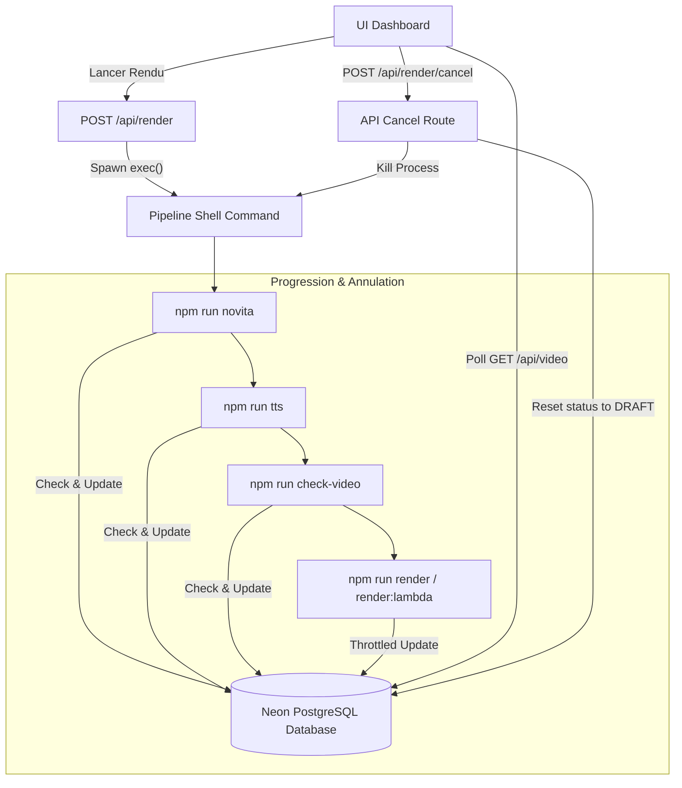

# Suivi de Rendu et Contrôle de Production Vidéo

Ce document résume l'implémentation du système de suivi de progression en temps réel et du contrôle d'annulation des rendus pour le pipeline `pipevideo`.

---

## 🚀 Fonctionnalités Implémentées

### 1. Structure de Données (Prisma Schema)
Des champs dédiés ont été ajoutés à la table `Video` pour modéliser le niveau de progression et l'action courante :
*   `progress`: Un entier représentant le pourcentage de complétion global (de `0` à `100`).
*   `progressStep`: Une chaîne de caractères décrivant l'étape en cours (ex: `"Génération des vidéos IA (3/6)"`).

### 2. Gestion des Processus (`renderRegistry.ts`)
*   Une map globale en mémoire `activeRenders` associe l'ID d'une vidéo au processus enfant (`ChildProcess`) Next.js.
*   En développement, cette map est attachée à l'objet `global` de Node.js pour éviter d'être réinitialisée lors des rechargements à chaud (Hot Reload).

### 3. Pipeline de Rendu Résilient avec Mises à Jour et Annulation
Chaque script du pipeline utilise le module partagé `src/lib/progressHelper.ts` pour mettre à jour la base de données et vérifier si l'utilisateur a annulé l'opération :

1.  **Génération de Médias (`novita.ts`)** :
    *   **Progression** : de `5%` à `40%`.
    *   Mise à jour progressive après le téléchargement réussi de la vidéo de chaque scène.
2.  **Synthèse Vocale (`tts.ts`)** :
    *   **Progression** : de `40%` à `55%`.
    *   Mise à jour après la génération ou validation de la voix off de chaque scène.
3.  **Vérification de Durée (`check-media.ts`)** :
    *   **Progression** : `55%` à `57%`.
    *   Vérifie que les médias sont bien synchronisés avec le storyboard avant le rendu.
4.  **Moteur de Rendu Remotion (`render.ts` / `render-lambda.ts`)** :
    *   **Progression** : de `57%` à `100%`.
    *   *Rendu Local* : Utilise la fonction `onProgress` de Remotion pour mettre à jour le pourcentage global.
    *   *Rendu AWS Lambda* : Récupère la progression directement depuis l'API AWS Lambda S3/Concurrency et l'envoi sur S3.
    *   **Optimisation (Throttling)** : Pour éviter de surcharger la base de données de requêtes d'écriture, les mises à jour de progression sont limitées à un maximum d'une écriture par intervalle de 3 secondes ou d'un saut de 5%.

### 4. Double Sécurité d'Annulation
L'annulation via l'endpoint `/api/render/cancel` offre une double couche de protection :
1.  **OS-level Kill** : Le processus parent (shell command) est directement tué via `SIGTERM` par le serveur Next.js.
2.  **State-driven Exit** : Les scripts de travail (`novita.ts`, `tts.ts`, `render.ts`, etc.) effectuent un contrôle en base de données avant chaque action clé (boucles de polling de Novita, génération TTS par scène, frame rendering). Si le statut de la vidéo n'est plus `RENDERING` (ex: passé à `DRAFT` via l'API cancel), le script s'arrête proprement et immédiatement (`process.exit(0)`).

### 5. Interface Utilisateur (Dashboard Client UI)
*   **Polling Dynamique** : Le client React détecte toute vidéo ayant le statut `RENDERING` et interroge régulièrement l'endpoint `GET /api/video?id={id}` (toutes les 2 secondes) pour récupérer la progression en temps réel.
*   **Barre de Progression Premium** : Affiche un indicateur visuel animé avec gradient violet/bleu brillant, ainsi que le libellé textuel de l'étape courante.
*   **Bouton d'Annulation** : Permet à l'utilisateur de cliquer sur "Annuler le Rendu", déclenchant une requête vers `/api/render/cancel` et réinitialisant instantanément la carte de la vidéo au statut Brouillon.

---

## 🛠️ Architecture du Pipeline de Progression

